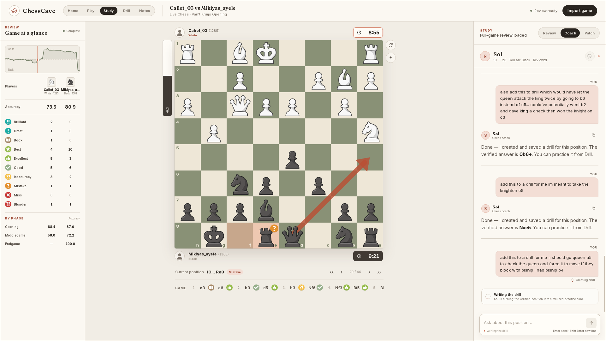

<p align="center">
  
</p>



ChessCave is a private desktop app for playing chess, reviewing your games, and
practicing the mistakes you want to remember. Stockfish checks the chess. A
Codex coach explains positions and answers questions in plain language.

ChessCave stores your studies, notes, reviews, and practice cards on your
computer. Home requests public Chess.com data for the username you choose. When
you use the coach, ChessCave gives Codex the current game or position and your
question so it can answer.

## What you can do

### Home

Enter a Chess.com username to see its public profile, current Rapid and Blitz
ratings, recent rating changes, and recent games. Choose a game to open it in
Study. ChessCave remembers the username and the last loaded dashboard on this
device.

### Play

Play a full game against Stockfish as White or Black, or choose Self play to
move both colors. Turn on Coach view to see the evaluation, move labels, and
best-move arrows. In self-play, the arrow follows the side to move. Sol
commentary is optional and starts off.

### Study

Open a recent Chess.com game or paste a game in PGN format. Stockfish reviews
the full game and shows:

- the evaluation after each move
- mistakes, missed chances, and strong moves
- the best move and other useful lines
- a graph of how the winning chances changed
- accuracy for each player and for each part of the game
- the opening name

Use the arrow keys or board controls to move through the game. You can make
legal moves on the board to try a different line without changing the imported
game.

The Coach tab lets you ask questions about the current position. The Patch tab
turns one of your mistakes into a practice card. Stockfish checks the answer
before the card is saved.

### Drill

Practice the cards you made in Study. Each card starts at the position where
you made a mistake and asks you to choose a move on the board. The answer and
lesson stay hidden until you commit to a move.

Afterward, choose **Again** if you need another look or **Understood** if the
idea was clear. ChessCave uses that answer to decide when the card should return.
You can also reopen the source game or delete a card.

### Notes

Keep private chess notes on this device. Create pages and nested pages, then add
paragraphs, headings, lists, quotes, tasks, and code blocks. Type `/` to choose a
block type. Notes save as you write and support undo and redo.

### Conversion Trainer

After Stockfish reviews a game in Study, choose **Practice this lead** to replay
a position where you had a winning advantage. Pick a playing strength and try
to finish the game against Stockfish. You can use the clock from the original
game when one is available. At the end, ChessCave shows where the advantage
started to slip.

## Board controls

- Press Left or Right to move backward or forward through a game. These keys do
  nothing while you are typing in a field.
- Drag a piece to a legal square, or select the source and destination squares.
- Right-drag on the board to draw a yellow arrow. Hold Shift for green, Ctrl for
  red, or Alt for blue.
- Right-click a square to highlight it.
- Left-click the board or change the position to clear your arrows and
  highlights.
- In Study, reviewed moves may show Stockfish's better move as a green arrow.

## What you need

ChessCave needs Stockfish on the system `PATH`. The coaching features also need
a working local Codex installation and login.

On NixOS, add Stockfish to `configuration.nix`:

```nix
environment.systemPackages = with pkgs; [
  stockfish
];
```

Apply the change, open a new terminal, and check that Stockfish is available:

```sh
sudo nixos-rebuild switch
command -v stockfish
```

If Stockfish is installed somewhere else, set `CHESSCAVE_STOCKFISH_PATH` to its
full path. You can also use `CHESSCAVE_CODEX_PATH` and `CHESSCAVE_NODE_PATH` when
those commands have non-standard names.

## Run the app for development

The included Nix shell provides Rust and the Linux packages needed to build the
desktop app:

```sh
nix-shell
bun install
bun run tauri dev
```

If those packages are already installed, run `bun install` and
`bun run tauri dev` directly.

## Where the data comes from

### Chess.com

Home uses Chess.com's read-only
[Published Data API](https://support.chess.com/en/articles/9650547-what-is-the-pubapi-and-how-do-i-use-it).
It requests the selected public profile, ratings, and recent games. ChessCave
stores the chosen username and the latest dashboard copy in the app. Chess.com
may return cached data for up to twelve hours.

When you open a game, ChessCave saves its PGN as the active study. A finished
Stockfish review is also saved, so opening the same game again does not repeat
the full review.

### Opening names

Opening names come from the CC0
[`lichess-org/chess-openings`](https://github.com/lichess-org/chess-openings)
data included in the app. ChessCave does not contact an opening service. See
[data/openings/README.md](data/openings/README.md) for the included version and
the update command.

### Move labels and accuracy

ChessCave calculates move labels, winning chances, and accuracy with published
methods from Chesskit and Lichess. The app has its own Rust and TypeScript
implementation and adds opening moves, positive move labels, and missed-chance
checks.

- [Chesskit win percentage](https://github.com/GuillaumeSD/Chesskit/blob/main/src/lib/engine/helpers/winPercentage.ts)
- [Chesskit accuracy](https://github.com/GuillaumeSD/Chesskit/blob/main/src/lib/engine/helpers/accuracy.ts)
- [Chesskit move classification](https://github.com/GuillaumeSD/Chesskit/blob/main/src/lib/engine/helpers/moveClassification.ts)
- [Lichess accuracy guide](https://lichess.org/page/accuracy)
- [`AccuracyPercent.scala`](https://github.com/lichess-org/lila/blob/master/modules/analyse/src/main/AccuracyPercent.scala)
- [`Advice.scala`](https://github.com/lichess-org/lila/blob/master/modules/tree/src/main/Advice.scala)
- [`Divider.scala`](https://github.com/lichess-org/scalachess/blob/master/core/src/main/scala/Divider.scala)
- [Lichess winning-chance discussion](https://github.com/lichess-org/lila/pull/11148)

The Lichess code linked above uses the GNU Affero General Public License 3.0 or
later.

ChessCave's brilliant-move check also draws on these public descriptions and
research:

- [Chess.com's Brilliant and Great Move rules](https://support.chess.com/en/articles/8572705-how-are-moves-classified-what-is-a-blunder-or-brilliant-etc)
- [Zaidi and Guerzhoy, "Predicting User Perception of Move Brilliance in Chess"](https://arxiv.org/abs/2406.11895)
- [`kamronzaidi/brilliant-moves-clf`](https://github.com/kamronzaidi/brilliant-moves-clf)
- [`dev-arcturus/positional_chess`](https://github.com/dev-arcturus/positional_chess)

ChessCave does not copy code from those projects. Its check uses the legal
captures in the position, the material changes in a short Stockfish line, the
player's rating when the PGN includes it, and Stockfish's saved search results.

## Checks

`bun run release:check` runs the Svelte and TypeScript checks, frontend tests,
the production web build, Rust formatting, Clippy, and Rust tests.

```sh
bun run release:check
```

Run the live coach check separately because it needs Stockfish and a local Codex
login:

```sh
bun run smoke:coach
```

Build the desktop installers after all checks pass:

```sh
bun run tauri build
```

The installers are written under `src-tauri/target/release/bundle/`. Code
signing and platform store credentials must be configured outside this
repository before publishing.

On NixOS, `linuxdeploy` may fail while creating the AppImage. Build the Debian
and RPM packages locally, then build the AppImage on Ubuntu:

```sh
bun run tauri build --bundles deb,rpm
```

## Project structure

Svelte draws the app and handles short-lived screen state. Rust runs Stockfish
and Codex, reads and writes local files, and manages those processes. The Codex
coach can read the active chess position and saved review, but it cannot change
them directly.

More detail is in [docs/architecture.md](docs/architecture.md) and
[docs/game-review.md](docs/game-review.md).

ChessCave uses the [MIT License](LICENSE).

Stockfish uses the GNU General Public License version 3. Any distributed build
that includes Stockfish must also include its license and the source information
required by that license.
