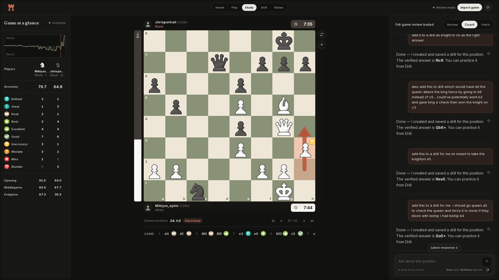
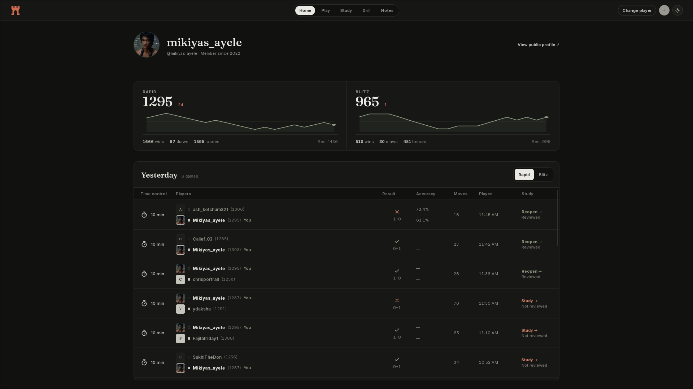
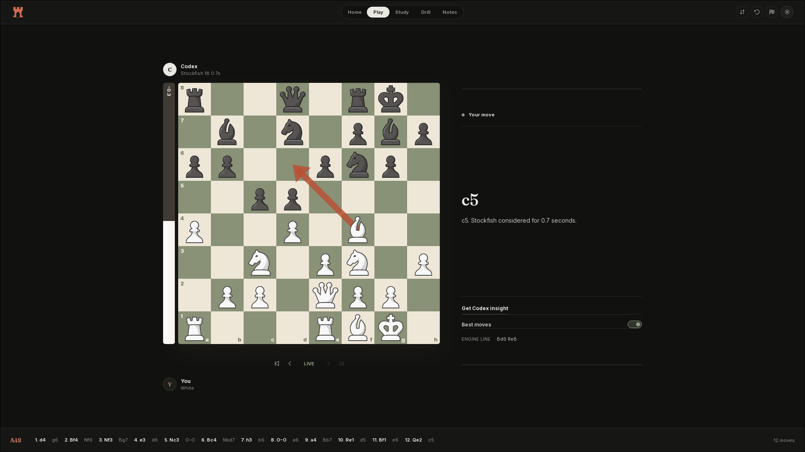
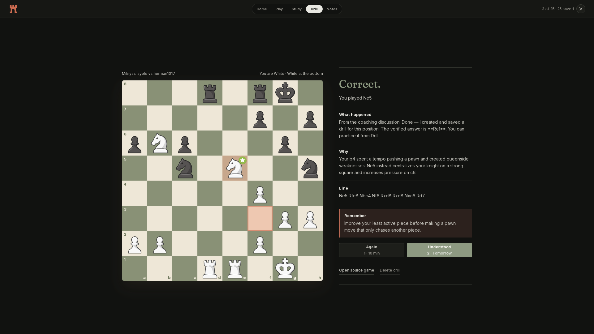
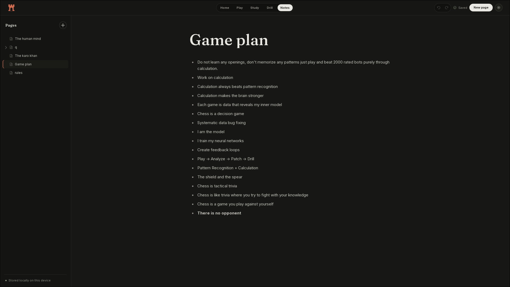

<p align="center">
  
</p>

<h1 align="center">ChessCave</h1>

<p align="center">
  <strong>Play, review, and practice chess on your own computer.</strong>
</p>

<p align="center">
  <a href="https://github.com/0xmiki/chesscave/releases/latest"></a>
  <a href="https://github.com/0xmiki/chesscave/actions/workflows/ci.yml"></a>
  <a href="LICENSE"></a>
  
  
</p>

<p align="center">
  <a href="https://github.com/0xmiki/chesscave/releases/latest">Download</a>
  · <a href="CHANGELOG.md">Changelog</a>
  · <a href="docs/architecture.md">Architecture</a>
</p>



<p align="center"><sub>Review a complete game with Stockfish, explore the board, and ask Codex about the position.</sub></p>

ChessCave is a desktop app for studying your own chess. It can load recent
Chess.com games or a PGN, run a Stockfish review, save mistakes as drills, and
keep chess notes. Your studies, reviews, drills, and notes stay on your
computer. Codex is optional and responds only when you ask.

## Before you install

[Stockfish](https://stockfishchess.org/download/) is required and is not bundled
with ChessCave. Install it, then check that this command works:

```sh
stockfish
```

Type `quit` to close the engine. ChessCave looks for `stockfish` on the system
`PATH`. If the executable is elsewhere, set `CHESSCAVE_STOCKFISH_PATH` to its
full path before starting the app.

The Codex coach is optional. It needs a working local Codex installation and
login. ChessCave sends Codex the current game or position only after you ask for
an explanation. ChessCave discovers the available models at startup. It prefers
Luna for live coaching and Terra for study, with Terra or the catalog default as
a fallback. Model-access rejections get one retry with an available alternative;
usage limits still apply.

## Download

Installers are attached to the
[latest GitHub release](https://github.com/0xmiki/chesscave/releases/latest).

| System | Files |
| --- | --- |
| Linux x64 | `.deb` and `.AppImage` |
| Windows x64 | `.exe` and `.msi` |
| macOS Apple Silicon | `aarch64.dmg` |
| macOS Intel | `x64.dmg` |

Windows builds are currently unsigned. macOS builds use ad-hoc signing. The
operating system may ask you to confirm that you want to open the app.

## What it does

- **Play.** Play Stockfish as White or Black, or move both colors in self-play.
- **Coach view.** Show the evaluation, move labels, best-move arrow, and engine
  line. Best-move help has its own switch.
- **Codex insight.** Request one explanation of the current position. ChessCave
  does not generate commentary after every move.
- **Study.** Review a Chess.com game or imported PGN with Stockfish. Step through
  moves, compare alternatives, and inspect accuracy and turning points.
- **Drill.** Save a mistake from Study and replay the position later. Stockfish
  checks the answer before the drill is saved.
- **Conversion Trainer.** Replay a position where a winning advantage slipped
  away and try to finish the game against Stockfish.
- **Notes.** Keep pages and nested pages for openings, games, and plans.
- **Local storage.** Reviews, drills, and notes stay on the computer running the
  app.

## Screens

### Home



Enter a Chess.com username to see its public Rapid and Blitz ratings, recent
rating changes, and latest games. Open any listed game in Study.

### Play



Play Stockfish or control both sides. Coach view adds engine feedback. Turn off
Best moves when you want to play without the arrow and line. Use Get Codex
insight when you want a short explanation of the position.

### Study


Open a recent game or paste PGN. Stockfish reviews every move and shows
accuracy, move labels, the evaluation graph, engine lines, and the opening. Try
legal alternatives on the board without changing the imported game.

### Drill



Practice positions saved from Study. Choose Again to repeat the drill soon or
Understood to schedule it later. The source game remains one click away.

### Notes



Create pages and nested pages with paragraphs, headings, lists, quotes, tasks,
and code blocks. Type `/` to change the block type. Notes save as you write.

## Controls

| Input | Action |
| --- | --- |
| Drag a piece | Move it to a legal square |
| Click two squares | Select and move a piece |
| Left / Right | Move backward or forward through game history |
| Shift + Arrow keys | Move keyboard focus between board squares |
| Right-drag | Draw a yellow arrow |
| Shift / Ctrl / Alt + right-drag | Draw a green, red, or blue arrow |
| Right-click | Mark a square |
| `1` / `2` in Drill | Again / Understood |

Arrow keys do nothing while you are typing in a field.

## Run from source

Install [Bun](https://bun.sh/), Rust, the
[Tauri system dependencies](https://v2.tauri.app/start/prerequisites/), and
Stockfish. Then run:

```sh
bun install --frozen-lockfile
bun run tauri dev
```

On NixOS, the included shell provides Rust and the Linux build packages:

```sh
nix-shell
bun install --frozen-lockfile
bun run tauri dev
```

Stockfish must still be installed system-wide on NixOS:

```nix
environment.systemPackages = with pkgs; [
  stockfish
];
```

Use `CHESSCAVE_CODEX_PATH` and `CHESSCAVE_NODE_PATH` if those commands have
non-standard names.

## Checks

Run the complete local check before committing code:

```sh
bun run release:check
```

This runs Svelte and TypeScript checks, all frontend tests, the production web
build, Rust formatting, Clippy, and Rust tests.

The live Codex check needs Stockfish and a local Codex login:

```sh
bun run smoke:coach
```

## Build installers

```sh
bun run tauri build
```

Tauri writes installers to `src-tauri/target/release/bundle/`. On NixOS,
`linuxdeploy` may fail while making an AppImage. Build Debian and RPM packages
locally, then let the Ubuntu release runner make the AppImage:

```sh
bun run tauri build --bundles deb,rpm
```

## Publish a release

Update the version in `package.json`, `src-tauri/tauri.conf.json`, and
`src-tauri/Cargo.toml`. Commit the change, then push the matching tag:

```sh
git tag v0.2.0
git push origin v0.2.0
```

The release workflow runs every check and builds Linux, Windows, Intel macOS,
and Apple Silicon macOS installers. GitHub creates a draft release with the
files attached. Review the draft before publishing it.

## Data and analysis

- Home reads public profiles and games from the Chess.com
  [Published Data API](https://support.chess.com/en/articles/9650547-what-is-the-pubapi-and-how-do-i-use-it).
  Chess.com may return cached data for up to twelve hours.
- Opening names come from the CC0
  [`lichess-org/chess-openings`](https://github.com/lichess-org/chess-openings)
  data included with the app.
- Finished Stockfish reviews are saved locally. Opening the same game again does
  not repeat the full review unless you request it.

<details>
<summary>Move labels, accuracy, and source material</summary>

ChessCave implements published Chesskit and Lichess methods for winning
chances, accuracy, move classification, and game phases:

- [Chesskit win percentage](https://github.com/GuillaumeSD/Chesskit/blob/main/src/lib/engine/helpers/winPercentage.ts)
- [Chesskit accuracy](https://github.com/GuillaumeSD/Chesskit/blob/main/src/lib/engine/helpers/accuracy.ts)
- [Chesskit move classification](https://github.com/GuillaumeSD/Chesskit/blob/main/src/lib/engine/helpers/moveClassification.ts)
- [Lichess accuracy guide](https://lichess.org/page/accuracy)
- [`AccuracyPercent.scala`](https://github.com/lichess-org/lila/blob/master/modules/analyse/src/main/AccuracyPercent.scala)
- [`Advice.scala`](https://github.com/lichess-org/lila/blob/master/modules/tree/src/main/Advice.scala)
- [`Divider.scala`](https://github.com/lichess-org/scalachess/blob/master/core/src/main/scala/Divider.scala)
- [Lichess winning-chance discussion](https://github.com/lichess-org/lila/pull/11148)

The linked Lichess code uses the GNU Affero General Public License 3.0 or later.

The brilliant-move check also draws on these public descriptions and research:

- [Chess.com's Brilliant and Great Move rules](https://support.chess.com/en/articles/8572705-how-are-moves-classified-what-is-a-blunder-or-brilliant-etc)
- [Zaidi and Guerzhoy, "Predicting User Perception of Move Brilliance in Chess"](https://arxiv.org/abs/2406.11895)
- [`kamronzaidi/brilliant-moves-clf`](https://github.com/kamronzaidi/brilliant-moves-clf)
- [`dev-arcturus/positional_chess`](https://github.com/dev-arcturus/positional_chess)

ChessCave does not copy code from those projects. It checks legal captures,
material changes in a short Stockfish line, the player's rating when available,
and saved Stockfish search results.

</details>

## Project layout

- `src/` contains the Svelte interface and short-lived screen state.
- `src-tauri/` contains the Rust desktop process, Stockfish integration, Codex
  process management, and local SQLite storage.
- `scripts/` contains the local ChessCave MCP server and data-build tools.
- `data/openings/` contains the pinned opening-name data.

Read [docs/architecture.md](docs/architecture.md) and
[docs/game-review.md](docs/game-review.md) for more detail.

## License

ChessCave uses the [MIT License](LICENSE).

Stockfish uses the GNU General Public License version 3. ChessCave does not
bundle Stockfish. If that changes, distributed builds must include Stockfish's
license and source information.
